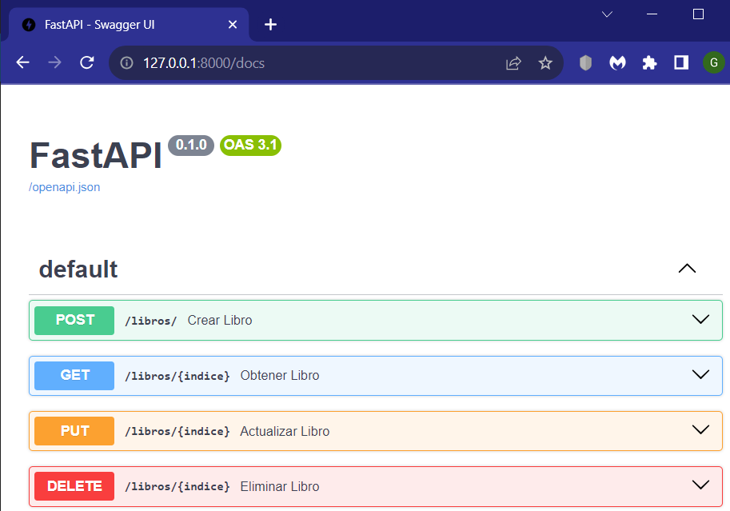

# PROYECTO CONSTRUCCIÓN Y EVOLUCIÓN DE SOFTWARE - GRUPO 5
## Integrantes:
- Kevin Condor
- Jackson Ramón
- Jean Villacis
## Descripción
La API ha sido diseñada para gestionar eficientemente información sobre libros permitiendo realizar las operaciones de crear, leer, actualizar y eliminar (CRUD). 

Se puede usar este recurso a traves de Postman o, a su vez, se puede utilizar la interfaz gráfica que genera la propia API debido a que fue creada usando el framework "FastAPI". En este caso, se hará uso de la interfaz que facilita FastAPI, más adelante, se explicará a detalle este apartado.
## Documentación
### Pasos previos
1. Descargar Python desde Microsoft Store (en Windows) o desde la página oficial de Python (https://www.python.org/downloads/).
2. Seleccionar una ubicación en el disco para clonar el repositorio de GitHub. 
3. Usando la herramienta Git Bash, moverse a la ubicación seleccionada para clonar.

    `cd "C:\Ruta_Ejemplo"`
4. Clonar el repositorio usando el comando:

    ```sh
    git clone https://github.com/JeanPierreVillacis/ProyectoGrupo5CYESW.git
    ```
5. Abrir el **Símbolo del sistema** (Windows) o la **Terminal** (Linux o Mac) y dirigirse al directorio donde se clonó el repositorio.
6. Crear un entorno virtual de Python, en este caso tendrá el nombre de apicys pero puede ser cualquiera.

    ```sh
    python -m venv apicys-env
    ```
7. Activar el entorno virtual.

    Windows: 
    
    ```cmd
    apicys-env\Scripts\activate.bat
    ```
    
    Linux o Mac: 
    
    ```sh
    source apicys-env/bin/activate
    ```
8. Verificar que el entorno virtual esté activado, para esto se tiene que observar que en la linea de comandos se haya puesto el nombre del entorno virtual entre parentesis antes de la ruta sobre la que se esté trabajando, por ejemplo:

    `(apicys-env) C:\Ruta_Ejemplo`
9. Instalar **fastapi** y el servidor **uvicorn**.

    ```sh
    pip install fastapi
    ```

    ```sh
    pip install uvicorn
    ```
10. Levantar el servidor de **uvicorn** para comenzar a usar la API usando el siguiente comando.

    ```sh
    uvicorn main:app --reload
    ```

    En este caso, se está especificando a uvicorn que busque dentro del fichero *main.py* la variable *app* que deberá ser una instancia de la clase *FastAPI*.

Varias partes de la información presentada en este apartado no son de autoría del grupo de desarrollo. A continuación, se facilitan los enlaces a la documentación para la creación de **Entornos virtuales en Python** y para la instalación del framework **FastAPI**.

**Entornos virtuales en Python**: https://docs.python.org/es/3/tutorial/venv.html

**Framework FastAPI**: https://fastapi.tiangolo.com/

### Funcionamiento de la API
- **Acceder al servicio REST**
    1. Tomar la dirección IP asiganada al momento de levantar el servidor de uvicorn.

        `Uvicorn running on ←[1mhttp://127.0.0.1:8000←[`
    2. Pegar la dirección IP en cualquier navegador y de esta forma se podría empezar a interactuar con la API. No obstante, en este caso unicamente se podrán hacer peticiones GET.
    3. Para trabajar con las demas peticiones HTTP se puede usar **Postman** o usar la **Interfaz Web** que provee FastAPI, para este caso, se usará la segunda opción mencionada.
    4. Luego de ingresar la dirección IP en el navegador, especificar que se desea acceder al recurso **docs** de la API, como se muestra a continuación.

        `http://127.0.0.1:8000/docs`

        De esta forma, se accederá a una interfaz web como la que se muestra a continuación.

        
- **Lógica de los métodos de petición HTTP**

Para trabajar con este apartado se creó una entidad Libro (clase) que cuenta con cuatro atributos que son título, autor, páginas y editorial.

```python
class Libro(BaseModel):
    titulo: str
    autor: str
    paginas: int
    editorial: Optional[str]
```
En este caso se puede observar que la clase *Libro* esta heredando de una clase padre llamada *BaseModel* que forma parte de la librería *pydantic*. El objetivo de esta heréncia es hacer que cada uno de los atributos acepte un tipo de datos en específico y así evitar inconsistencias al momento de trabajar con la API. Adicionalmente, esta clase permite especificar si un atributo es opcional de ingresar, como los es el caso para **editorial**.

La API cuenta con la información de algunos libros que está guardada en una lista, con la finalidad de permitir probar las funcionalidades sin la necesidad de tener que crear previamente algunos registros. Teniendo en cuenta lo mencionado, continuación, se revisará la lógica de los métodos de petición GET, POST, PUT y DELETE.
1. **GET**

    Para solventar este método de petición se hace uso de la función *obtener_libro* que está dentro del archivo main.py. Recibe como parámetro un indice de tipo entero que corresponde a la posición que tiene un libro dentro de la lista que se mencionó anteriormente.

    ```python
    @app.get("/libros/{indice}", response_model=Libro)
    def obtener_libro(indice: int):
        if indice < 0 or indice >= len(base_de_datos):
            raise HTTPException(status_code=404, detail="Libro no encontrado")
        return base_de_datos[indice]
    ```
    La decoración *@app.get()* se utiliza para definir una ruta de tipo GET en una aplicación FastAPI. De esta forma, se especifica que se espera un parámetro "indice" en la URL y se devuelve un objeto JSON que sigue la estructura del modelo "Libro".
2. **POST**

    Para solventar este método de petición se hace uso de la función *crear_libro* que está dentro del archivo main.py. Recibe como parámetro un objeto de tipo Libro que será almacenado en la lista de libros.

    ```python
    @app.post("/libros/", response_model=Libro)
    def crear_libro(libro: Libro):
        base_de_datos.append(libro)
        return libro
    ```
    La decoración *@app.post()* se utiliza para definir una ruta POST en la aplicación web que espera datos enviados mediante una solicitud POST y devuelve una respuesta que se ajusta al formato del modelo "Libro".
3. **PUT**

    Para solventar este método de petición se hace uso de la función *actualizar_libro* que está dentro del archivo main.py. Recibe como parámetro un indice de tipo entero y un objeto de tipo Libro a ser actualizado.

    ```python
    @app.put("/libros/{indice}", response_model=Libro)
    def actualizar_libro(indice: int, libro: Libro):
        if indice < 0 or indice >= len(base_de_datos):
            raise HTTPException(status_code=404, detail="Libro no encontrado")
        
        base_de_datos[indice] = libro
        return libro
    ```
    La decoración *@app.put()* se utiliza en FastAPI para definir una ruta PUT en la aplicación web que espera actualizar un libro específico identificado por el valor de "indice" en la URL. La respuesta generada por esta ruta debe cumplir con las especificaciones del modelo "Libro".
4. **DELETE**

    Para solventar este método de petición se hace uso de la función *eliminar_libro* que está dentro del archivo main.py. Recibe como parámetro un indice de tipo entero que está asociado al libro que se desea eliminar.

    ```python
    @app.delete("/libros/{indice}", response_model=Libro)
    def eliminar_libro(indice: int):
        if indice < 0 or indice >= len(base_de_datos):
            raise HTTPException(status_code=404, detail="Libro no encontrado")
        
        libro_eliminado = base_de_datos.pop(indice)
        return libro_eliminado
    ```
    La decoración *@app.delete()* se utiliza en FastAPI para definir una ruta DELETE en la aplicación web que espera eliminar un libro específico identificado por el valor de "indice" en la URL. La respuesta generada por esta ruta debe cumplir con las especificaciones del modelo "Libro" y es una última referéncia del recurso eliminado.

Finalmente, se han logrado documentar los aspectos más importantes de la API desarrollada con la finalidad de guiar a las personas interesadas en lo relacionado a su estructura y funcionamiento. Para proporcionar un ejemplo de su uso se agregará un fichero PDF al repositorio dónde se muestre el uso de cada uno de los métodos mencionados anteriormente.

*Grupo 5 - Construcción y Evolución de Software - Escuela Politécnica Nacional*
